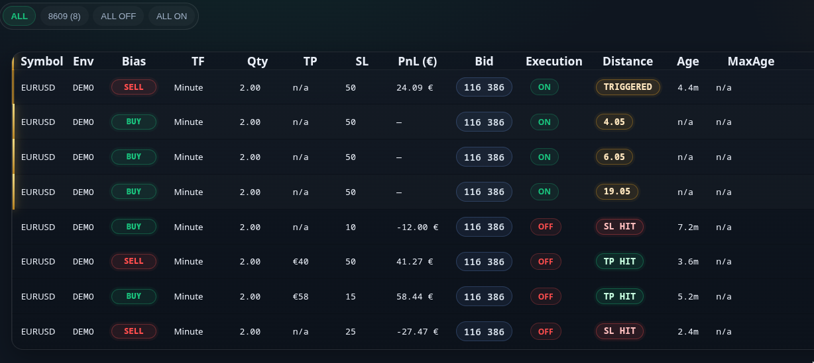

# LineFlow

## Turn Chart Structure Into Automated Execution

Draw a level. Define your risk.
LineFlow executes the trade when price reaches the structure.

Instead of watching charts waiting for entries, traders can define structural levels once and allow the execution engine to do the rest

When the market reaches the defined level, LineFlow automatically:

- executes the position
- places stop loss
- places take profit
- manages the lifecycle of the trade

> **The trader defines the structure.
> LineFlow handles the execution.**

*Rule-level execution monitoring with distance-qualified triggers and lifecycle tracking.*

---
# Execution Model

LineFlow converts chart structure into executable rules.

Execution flow:

draw structure
↓
define risk parameters
↓
activate rule
↓
distance engine monitors price
↓
trigger condition satisfied
↓
order execution
↓
automated lifecycle management

## Visual Execution Rule Engine for Financial Markets

LineFlow converts chart geometry into deterministic execution rules.

The system continuously measures the distance between market price and user-defined structures.
When predefined proximity conditions are satisfied, the execution engine triggers the trade and manages its lifecycle through embedded risk controls.

This includes:

- deterministic entry execution
- automatic stop-loss placement
- take-profit management
- rule lifecycle supervision
- multi-asset execution monitoring

# Why We Built LineFlow

Most discretionary traders spend large amounts of time watching charts, waiting for price to reach predefined levels.

Typical workflow:

draw level
wait for price
enter manually
place stop loss
manage take profit

This process requires constant screen time and introduces execution errors such as:

- missed entries
- late entries
- inconsistent stop placement
- emotional decision making

LineFlow was created to remove this friction.

Instead of waiting at the screen, traders can define their structural levels once and allow the execution engine to monitor price

When the market reaches the defined structure, LineFlow automatically:

- executes the trade
- places stop loss
- places take profit
- manages the lifecycle of the position

**The trader defines the structure.
LineFlow handles the execution.**

# Execution Architecture

Most platforms emphasize:

- Signal distribution
- Indicator overlays
- Copy trading mechanisms

LineFlow provides:

## Structured Geometric Execution Governance

- Distance-qualified triggers
- Embedded risk controls
- Directional integrity enforcement
- Lifecycle supervision
- Multi-asset execution oversight

LineFlow is not a signal provider.
It is an execution governance layer.

## 🔑 Core Editing Controls (All Inline Editors)

| Key / Shortcut | Function |
|----------------|----------|
| `Enter` | Commit changes |
| `Esc` | Revert and exit editor |
| `Backspace` | Delete character(s) |
| `Ctrl + Backspace` | Clear entire input field |

---

## ⚡ cTrader Execution Shortcuts

| Shortcut | Action |
|----------|--------|
| `Ctrl + Click` | Draw geometric line and assign bias (Above price → Sell ↓ / Below price → Buy ↑) |
| `Ctrl + M` | Open Quantity / Stop Loss editor |
| `Ctrl + P` | Open Take Profit editor |
| `Ctrl + T` | Toggle Execution ON / OFF |
| `Ctrl + K` | Open Hard Stop (EUR) editor |

Chart-level execution control interface.

# 📊 Execution Dashboard Columns

## Column Overview

| Column | Function |
|--------|----------|
| Symbol | Instrument linked to geometric execution structure |
| Env | Execution environment segregation (DEMO / LIVE) |
| Bias | Geometric directional orientation (↑ / ↓) |
| TF | Structural timeframe context |
| Qty | Rule-defined position size |
| TP | Optional geometric exit parameter |
| SL | Embedded stop-loss parameter |
| PnL (€) | Real-time rule-level performance |
| Bid | Live market price reference |
| Execution | Rule activation state |
| Distance | Price-to-structure proximity metric |
| Age | Rule lifecycle duration |
| MaxAge | Rule expiration threshold |

## Symbol

Financial instrument associated with the geometric execution structure
(e.g., USDJPY, XAUUSD, BTCUSD).

Provides centralized, multi-asset execution monitoring.

> Limitation: One symbol per chart instance.

---

## Env

Execution environment segregation.

- **DEMO** — Simulated execution
- **LIVE** — Production execution

Prevents unintended capital exposure through environment isolation.

> Multiple environments may operate concurrently.

---

## Bias

Directional orientation derived strictly from geometric configuration.

- **↑** — Upward structural bias
- **↓** — Downward structural bias

Execution direction is system-defined and non-discretionary.

---

## TF (Timeframe)

Timeframe on which geometric logic is instantiated.

Examples:

- Minute
- Minute15
- Hour4
- Daily

Maintains structural coherence between analysis context and execution.

> Timeframe switching while PnL and bot are active for a symbol is disabled (protective constraint).

---

## Qty

Rule-defined position sizing parameter.

Enforces capital allocation discipline and prevents discretionary resizing.

---

## TP (Take Profit)

Optional geometric exit parameter.

Activated according to structural rule configuration.

---

## SL (Stop Loss)

Stop-loss parameter derived from geometric structure.

Forms part of embedded risk governance.

---

## PnL (€)

Real-time rule-level performance tracking in account currency.

Provides execution-layer transparency.

---

## Bid

Live bid price feed.

Used to compute geometric distance thresholds.

---

## Execution

Rule activation governance.

- **ON** — Eligible for order transmission
- **OFF** — Alert-only mode (Telegram notification; no order execution)

Allows structural observation without execution commitment.

---

## Distance

Measured price deviation from geometric trigger threshold.

Primary control metric for:

- Entry qualification
- Execution timing precision
- Structural validity enforcement

Core differentiator of the execution model.

---

## Age

Elapsed time since rule activation.

Supports lifecycle supervision.

---

## MaxAge

Maximum permissible rule duration prior to automatic expiration.

Prevents structurally obsolete executions.

---

# ⚙ System Settings

| Parameter | Function |
|------------|------------|
| Advanced HUD | Enables extended execution telemetry overlay. |
| Show How To Use | Activates interface guidance display. |
| Allow Trading | Master execution authorization control. |
| Lots | Default rule-level position size. |
| Allow Email Notifications | Enables email-based alert transmission. |
| Email To | Recipient address for system notifications. |
| Email From | Sender identity configuration. |
| BotToken | Telegram authentication credential. |
| ChatID | Telegram routing identifier. |
| Python Endpoint | External execution relay endpoint for API integration. |
| Python Command | Structured command execution endpoint. |

---

# 🛡 Protection & Risk Engine

| Parameter | Function |
|------------|------------|
| Enable Break-Even | Activates automatic stop reallocation to entry threshold. |
| BE Trigger (pips) | Profit distance required to initiate break-even logic. |
| BE Offset (pips) | Additional offset applied during break-even transition. |
| BE Mode | Break-even computation model (e.g., OneR). |
| Enable Trailing Stop | Activates dynamic stop adjustment mechanism. |
| Trail Start (pips) | Profit threshold required before trailing activation. |
| Trail Step (pips) | Incremental trailing adjustment distance. |
| Hard Stop (EUR) | Absolute capital loss ceiling per position. |
| Stop Loss Pips | Fixed stop-loss override parameter. |
| Take Profit Pips | Fixed take-profit override parameter. |
| TP Min Tick Multiplier | Tick-size precision multiplier for exit placement. |
| Max Spread (pips) | Spread ceiling before execution suspension. |
| Alert when spread high | Spread threshold alert activation. |
| Spread Block Condition | Defines execution blocking criteria under spread conditions. |
| Spread Filter Mode | Spread measurement unit selection (pips / points). |
| Max Spread (points) | Spread ceiling when using point-based measurement. |
